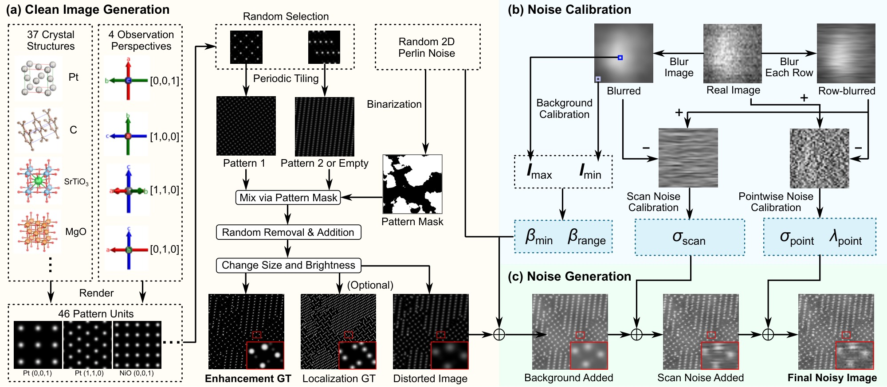
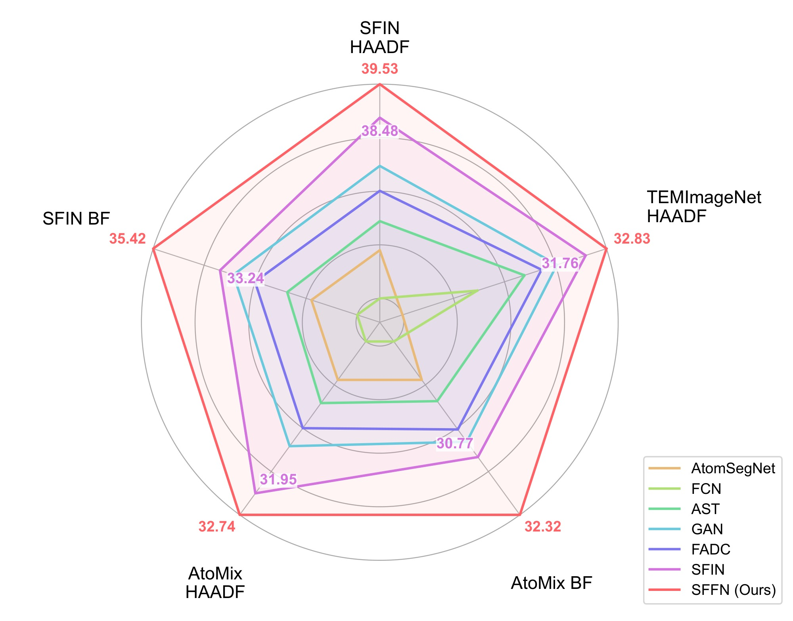
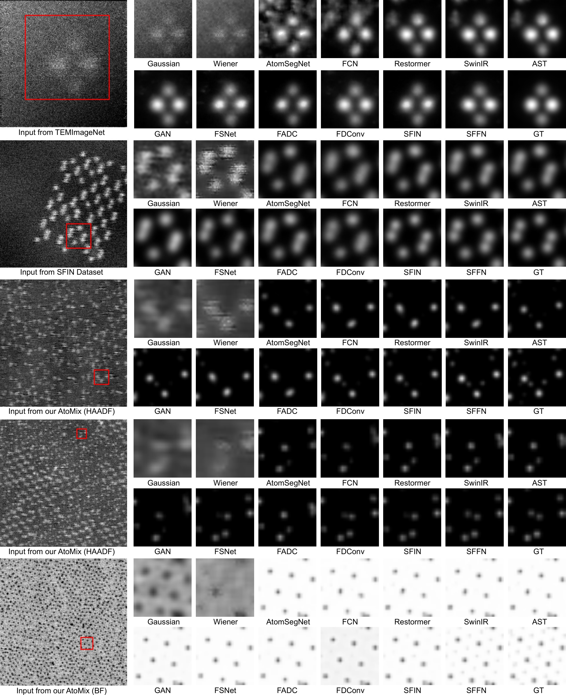
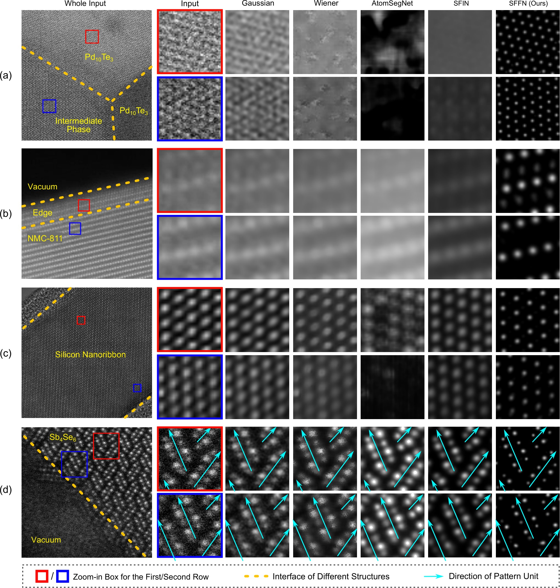
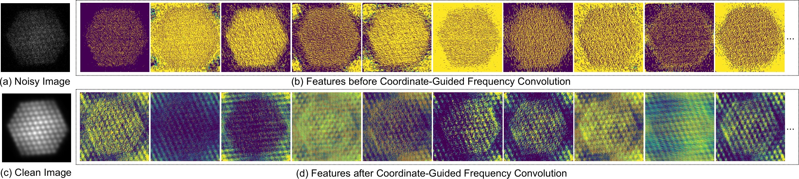
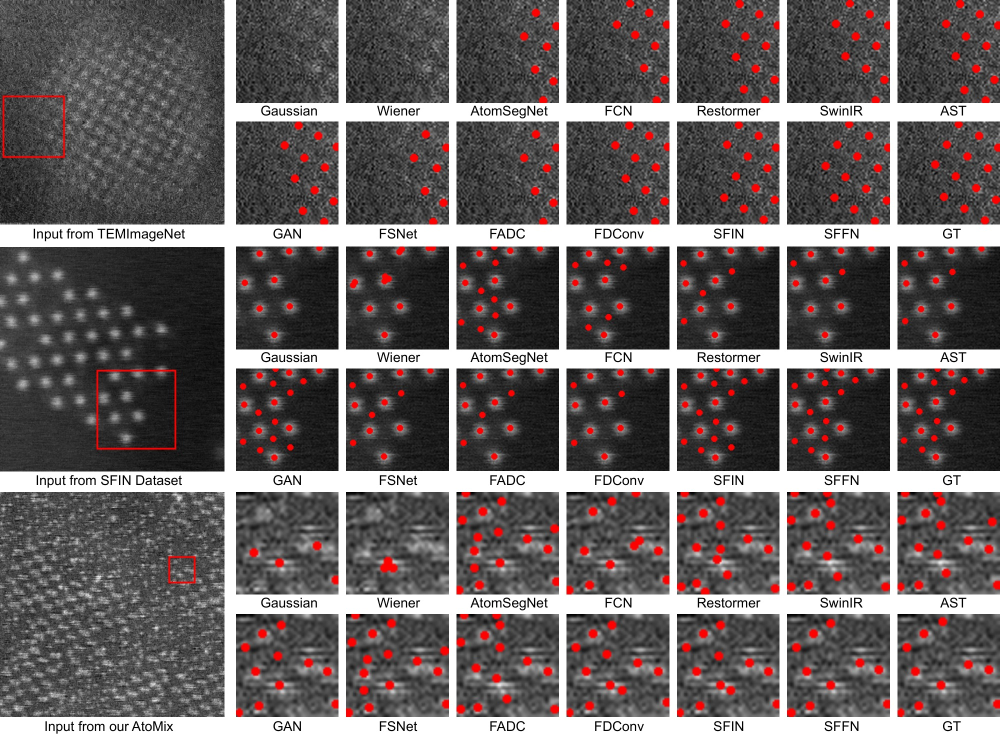

# SFFN

Code and data for the manuscript **Spatial-Frequency Learning for Scanning Transmission Electron Microscopy Image Enhancement**.

Authors: Hesong Li, Ying Fu, Ziqi Wu, Tao Zhang, and Ruiwen Shao.

<p align="center">
  
</p>

SFFN combines spatial and coordinate-guided frequency processing for atomic-scale STEM image enhancement. This repository contains the model, training scripts for HAADF/BF enhancement and atomic localization, dataset synthesis code, inference, and PSNR/SSIM evaluation.

## Method

SFFN couples local spatial processing with frequency-domain processing of periodic atomic arrangements. A shallow 3×3 convolution is followed by eight residual spatial-frequency fusion blocks and an output convolution. Each block splits the feature channels into spatial and frequency branches, then concatenates their outputs and learns their fusion with a 3×3 convolution.

**Coordinate-guided frequency convolution (CGFC).** The frequency branch applies a real FFT, concatenates the real and imaginary features with two coordinate channels, processes them with a 1×1 convolution, batch normalization, and ReLU, and transforms them back with an inverse real FFT. Frequency coordinates allow the convolution to treat frequency bands differently.

**Calibrated synthesis and AtoMix.** Noise parameters are estimated from real STEM images. The synthesis pipeline mixes atomic arrangements and models background, scan noise, pointwise noise, and blur for both HAADF and BF imaging modes.



*The manuscript's synthesis pipeline combines clean atomic-pattern generation, noise calibration, and degradation generation.*

## Results

### Image enhancement

The following results are reported in the manuscript's main enhancement table. Deep learning methods are trained and tested on the corresponding dataset. Each cell is **PSNR [dB] / SSIM**; higher is better. On AtoMix, SFFN reaches 32.74 dB / 0.9214 for HAADF and 32.32 dB / 0.9540 for BF.

| Method | TEMImageNet HAADF | SFIN HAADF | SFIN BF | AtoMix HAADF | AtoMix BF |
| --- | --- | --- | --- | --- | --- |
| Gaussian Filter | 16.78 / 0.4961 | 16.33 / 0.3303 | 10.30 / 0.6867 | 10.57 / 0.1053 | 10.17 / 0.5291 |
| Wiener Filter | 16.08 / 0.4991 | 16.43 / 0.3267 | 10.23 / 0.8081 | 10.59 / 0.0803 | 10.01 / 0.4405 |
| AtomSegNet | 22.34 / 0.8008 | 34.33 / 0.8994 | 30.26 / 0.9673 | 27.79 / 0.8240 | 28.70 / 0.8934 |
| FCN | 26.18 / 0.8842 | 32.82 / 0.8830 | 28.77 / 0.9623 | 26.38 / 0.7711 | 27.67 / 0.8765 |
| Restormer | 28.14 / 0.9113 | 34.82 / 0.9099 | 30.76 / 0.9745 | 28.28 / 0.8373 | 29.06 / 0.8945 |
| SwinIR | 28.33 / 0.9066 | 35.00 / 0.9085 | 30.81 / 0.9696 | 28.39 / 0.8387 | 29.18 / 0.8984 |
| AST | 28.61 / 0.9071 | 35.24 / 0.9076 | 31.05 / 0.9721 | 28.64 / 0.8431 | 29.27 / 0.9025 |
| GAN | 30.28 / 0.9311 | 36.97 / 0.9347 | 32.80 / 0.9759 | 30.22 / 0.868 | 30.36 / 0.9197 |
| FSNet | 28.11 / 0.9056 | 34.80 / 0.9067 | 30.83 / 0.9686 | 28.29 / 0.8305 | 29.09 / 0.8991 |
| FADC | 29.49 / 0.9269 | 36.19 / 0.9276 | 32.10 / 0.9808 | 29.56 / 0.8573 | 30.03 / 0.9202 |
| FDConv | 28.86 / 0.9160 | 35.58 / 0.9153 | 31.51 / 0.9702 | 28.94 / 0.8484 | 29.55 / 0.9048 |
| SFIN | 31.76 / 0.9543 | 38.48 / 0.9582 | 33.24 / 0.9885 | 31.95 / 0.9028 | 30.77 / 0.9333 |
| **SFFN (Ours)** | **32.83 / 0.9649** | **39.53 / 0.9666** | **35.42 / 0.9930** | **32.74 / 0.9214** | **32.32 / 0.9540** |

<p align="center"></p>

*PSNR overview from the manuscript. Each axis is normalized independently: the minimum and maximum among the displayed methods map to 10% and 100% of the radius. Numeric labels show PSNR in dB for SFIN and SFFN; use the table above for absolute comparisons.*



*Qualitative enhancement comparisons on synthetic datasets; methods use the training set corresponding to each test dataset.*

### Real STEM images



*Real-image examples cover superconducting materials, all-solid-state batteries, nanodevices, and neuromorphic computing materials. AtomSegNet, SFIN, and SFFN use their respective training datasets, as described in the manuscript.*

### Frequency features and ablation



*Feature visualizations before and after CGFC illustrate the recovery of periodic atomic signals. The displayed network features are from the sixth CGFC module.*

The manuscript's ablation experiment uses **AtoMix HAADF**. It compares spatial/frequency branches, cross-domain interaction, and frequency coordinates.

| Variant | Spatial | Frequency | Interaction | Coordinates | PSNR [dB] | SSIM |
| --- | --- | --- | --- | --- | --- | --- |
| SFFN-V1 | Yes | No | None | N/A | 27.80 | 0.8605 |
| SFFN-V2 | No | Yes | None | Yes | 29.40 | 0.8880 |
| SFFN-V3 | Yes | Yes | None | Yes | 31.60 | 0.9060 |
| SFFN-V4 | Yes | Yes | Addition | Yes | 31.73 | 0.9072 |
| SFFN-V5 | Yes | Yes | Convolution | No | 32.49 | 0.9193 |
| SFFN (Ours) | Yes | Yes | Convolution | Yes | 32.74 | 0.9214 |

### Atomic localization

Localization results from the manuscript are measured by **intersection over union (IoU)**; higher is better. Deep learning methods are trained and tested on the corresponding dataset.

| Method | TEMImageNet HAADF | SFIN HAADF | SFIN BF | AtoMix HAADF | AtoMix BF |
| --- | --- | --- | --- | --- | --- |
| Gaussian Filter | 0.1251 | 0.0965 | 0.0443 | 0.1655 | 0.1804 |
| Wiener Filter | 0.1144 | 0.0896 | 0.0439 | 0.1238 | 0.1397 |
| AtomSegNet | 0.5636 | 0.4507 | 0.3581 | 0.3601 | 0.3902 |
| FCN | 0.6061 | 0.4822 | 0.4096 | 0.2880 | 0.3451 |
| Restormer | 0.6650 | 0.5206 | 0.4513 | 0.4104 | 0.4001 |
| SwinIR | 0.6523 | 0.5150 | 0.4411 | 0.4084 | 0.4120 |
| AST | 0.6462 | 0.5035 | 0.4369 | 0.3325 | 0.3664 |
| GAN | 0.7089 | 0.5496 | 0.4481 | 0.4208 | 0.4778 |
| FSNet | 0.6511 | 0.5187 | 0.4329 | 0.4671 | 0.4147 |
| FADC | 0.6922 | 0.5428 | 0.4701 | 0.4398 | 0.4846 |
| FDConv | 0.6766 | 0.5271 | 0.4377 | 0.4239 | 0.4382 |
| SFIN | 0.5987 | 0.5694 | 0.4814 | 0.4809 | 0.5236 |
| **SFFN (Ours)** | **0.7765** | **0.5950** | **0.5224** | **0.5586** | **0.5911** |



*Qualitative atomic localization comparisons across synthetic datasets.*

## Installation

```bash
pip install -r requirements.txt
```

Use a matching PyTorch/torchvision installation for your CUDA version. Training scripts use CUDA; the inference script also supports CPU.

## Data

Download the datasets from [Google Drive](https://drive.google.com/drive/folders/1uBW3RZlmPFD82II6anT4zMC7TtD9_NQD). The folder is publicly accessible with read-only permissions. Dataset files are excluded from GitHub.

Download all six ZIP files. Each training dataset is split into two independently extractable archives to fit the upload size limit. Extract both parts into the same repository root; they merge into one dataset folder.

| Dataset | Archives | Samples |
| --- | --- | ---: |
| BF training | `bf_data3_part1.zip`, `bf_data3_part2.zip` | 1000 |
| HAADF training | `haadf_data3_part1.zip`, `haadf_data3_part2.zip` | 1000 |
| BF test | `bf_test_data3.zip` | 100 |
| HAADF test | `haadf_test_data3.zip` | 100 |

The Drive folder also contains `download_manifest.json` with archive sizes and SHA-256 checksums. After extraction, the layout is:

```text
SFFN/
  bf_data3/          # 1000 BF training samples
  haadf_data3/       # 1000 HAADF training samples
  bf_test_data3/     # 100 BF test samples
  haadf_test_data3/  # 100 HAADF test samples
```

Each dataset contains `noisy/`, `enhance_gt/`, and `local_gt/`. Images use numeric names, such as `0.png`. The local dataset names above correspond to the AtoMix data used by the supplied training scripts.

Precomputed visual outputs are available in [visual_results.zip](https://drive.google.com/file/d/1mbCorwZ2SgPW0xYqmPoAlYPU4DuyGpW3/view). Both this archive and `weights.zip` are in the same Drive folder as the datasets.

## How to Use

1. Download and extract the datasets from Google Drive.
2. Train the required model from the repository root:

   ```bash
   python train_convFuse_h3e.py --action train  # HAADF enhancement
   python train_convFuse_b3e.py --action train  # BF enhancement
   python train_convFuse_h3l.py --action train  # HAADF localization
   python train_convFuse_b3l.py --action train  # BF localization
   ```

   Checkpoints are saved every 50 epochs. The scripts resume from an existing checkpoint and run up to epoch 500. They retain the local implementation's `convFuse` checkpoint names.

3. Run inference with a checkpoint you trained:

   ```bash
   python ours_gpu_demo.py --checkpoint convFuse_h3e_500.pth --input haadf_test_data3/noisy --output convFuse_h3e_result
   ```

   Substitute the BF/localization checkpoint and corresponding input folder as needed. The four pretrained checkpoints are available in [weights.zip](https://drive.google.com/file/d/1_FVHz6lWEN0TEMk_6QQuuNA_dULKZD6-/view). Extract the archive and pass a checkpoint path such as `weights/convFuse_h3e_500.pth` to `--checkpoint`.

4. Compute enhancement PSNR/SSIM:

   ```bash
   python metrics.py --gt haadf_test_data3/enhance_gt --results convFuse_h3e_result
   ```

## Dataset Synthesis

`generate_bf.py` and `generate_haadf.py` synthesize images using the atomic structures and calibration parameters in `bf.py` and `haadf.py`. Each atomic column is rendered with a two-dimensional Gaussian profile. The pipeline mixes atomic patterns, randomly relocates atoms, and adds background, scan, and pointwise noise.

The original defaults are `bf_test_data3` with 100 samples and `haadf_data3` with 1000 samples. Do not run generation in a directory containing the released datasets, because these scripts write numeric PNG filenames into their output folders. No fixed random seed is set in the supplied synthesis scripts; regeneration does not reproduce the released images pixel for pixel.

## Citation

The manuscript has not been assigned final journal metadata in this release. Use the following manuscript citation, and update it when a publication record is available:

```bibtex
@misc{Li2026SFFN,
  title = {Spatial-Frequency Learning for Scanning Transmission Electron Microscopy Image Enhancement},
  author = {Li, Hesong and Fu, Ying and Wu, Ziqi and Zhang, Tao and Shao, Ruiwen},
  year = {2026},
  note = {Manuscript}
}
```

## Acknowledgments and Contact

The Fourier convolution implementation in `convFuse.py` references [FFC](https://github.com/pkumivision/FFC). The related conference project is [SFIN](https://github.com/HeasonLee/SFIN).

For questions, contact [Hesong Li](mailto:lihesong2@bit.edu.cn).
