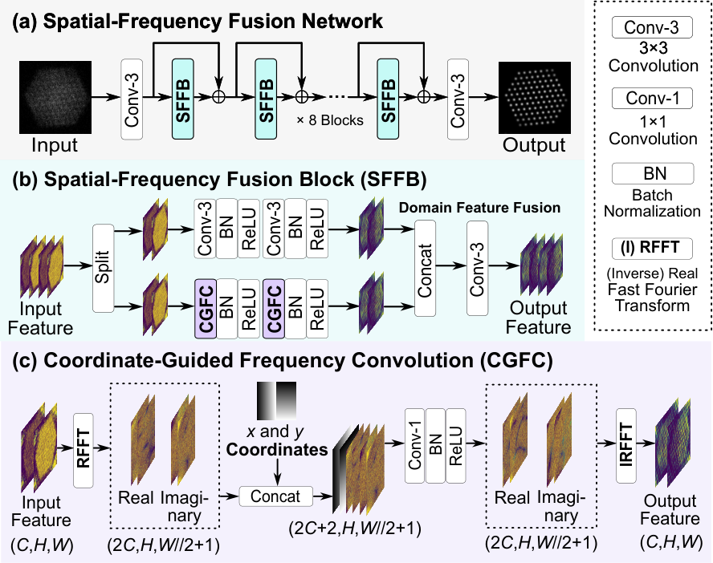

# SFFN

Code and data for the manuscript **Spatial-Frequency Learning for Scanning Transmission Electron Microscopy Image Enhancement**.

Authors: Hesong Li, Ying Fu, Ziqi Wu, Tao Zhang, and Ruiwen Shao.

<p align="center">
  
</p>

SFFN combines spatial and coordinate-guided frequency processing for atomic-scale STEM image enhancement. This repository contains the model, training scripts for HAADF/BF enhancement and atomic localization, dataset synthesis code, inference, and PSNR/SSIM evaluation.

## Installation

```bash
pip install -r requirements.txt
```

Use a matching PyTorch/torchvision installation for your CUDA version. Training scripts use CUDA; the inference script also supports CPU.

## Data

The datasets are hosted on Google Drive and are excluded from GitHub. The verified download link will be added after upload completes.

Extract the four ZIP files into the repository root so that the layout is:

```text
SFFN/
  bf_data3/          # 1000 BF training samples
  haadf_data3/       # 1000 HAADF training samples
  bf_test_data3/     # 100 BF test samples
  haadf_test_data3/  # 100 HAADF test samples
```

Each dataset contains `noisy/`, `enhance_gt/`, and `local_gt/`. Images use numeric names, such as `0.png`. The local dataset names above correspond to the AtoMix data used by the supplied training scripts.

## How to Use

1. Download and extract the datasets from Google Drive.
2. Train the required model from the repository root:

   ```bash
   python train_convFuse_h3e.py --action train  # HAADF enhancement
   python train_convFuse_b3e.py --action train  # BF enhancement
   python train_convFuse_h3l.py --action train  # HAADF localization
   python train_convFuse_b3l.py --action train  # BF localization
   ```

   Checkpoints are saved every 50 epochs. The scripts resume from an existing checkpoint and run up to epoch 500. They retain the local implementation's `convFuse` checkpoint names.

3. Run inference with a checkpoint you trained:

   ```bash
   python ours_gpu_demo.py --checkpoint convFuse_h3e_500.pth --input haadf_test_data3/noisy --output convFuse_h3e_result
   ```

   Substitute the BF/localization checkpoint and corresponding input folder as needed. Pretrained checkpoints are not included in this release.

4. Compute enhancement PSNR/SSIM:

   ```bash
   python metrics.py --gt haadf_test_data3/enhance_gt --results convFuse_h3e_result
   ```

## Dataset Synthesis

`generate_bf.py` and `generate_haadf.py` synthesize images using the atomic structures and calibration parameters in `bf.py` and `haadf.py`. Each atomic column is rendered with a two-dimensional Gaussian profile. The pipeline mixes atomic patterns, randomly relocates atoms, and adds background, scan, and pointwise noise.

The original defaults are `bf_test_data3` with 100 samples and `haadf_data3` with 1000 samples. Do not run generation in a directory containing the released datasets, because these scripts write numeric PNG filenames into their output folders. No fixed random seed is set in the supplied synthesis scripts; regeneration does not reproduce the released images pixel for pixel.

## Citation

The manuscript has not been assigned final journal metadata in this release. Use the following manuscript citation, and update it when a publication record is available:

```bibtex
@misc{Li2026SFFN,
  title = {Spatial-Frequency Learning for Scanning Transmission Electron Microscopy Image Enhancement},
  author = {Li, Hesong and Fu, Ying and Wu, Ziqi and Zhang, Tao and Shao, Ruiwen},
  year = {2026},
  note = {Manuscript}
}
```

## Acknowledgments and Contact

The Fourier convolution implementation in `convFuse.py` references [FFC](https://github.com/pkumivision/FFC). The related conference project is [SFIN](https://github.com/HeasonLee/SFIN).

For questions, contact [Hesong Li](mailto:lihesong2@bit.edu.cn).
